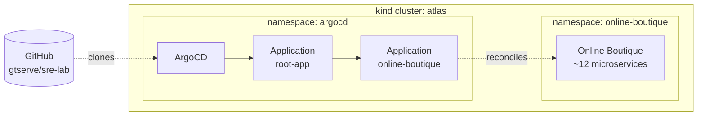

# SRE Lab

> A self-contained, fully local Site Reliability Engineering practice
> ground. GitOps-managed Kubernetes on a laptop — no cloud, no bill,
> no vendor lock-in.

**Status:** Phase 0 — bootstrap. Local kind cluster + ArgoCD up;
Online Boutique reconciling via GitOps. Observability stack (Phase 1)
is next.

---

## What this is

A public portfolio project that exercises the four pillars of Site
Reliability Engineering — Service Level Objectives, observability,
chaos engineering, and incident response — on top of a real polyglot
microservices application. Extended with progressive delivery, an
automation hub for toil reduction, policy enforcement, cost
visibility, and capacity planning.

Everything runs on a developer laptop using [kind]. The entire stack
is open source and reproducible from a single `make` command.

The 18-week roadmap is described in [`docs/plan.md`](docs/plan.md).

[kind]: https://kind.sigs.k8s.io

## Architecture (Phase 0)



A single multi-node kind cluster runs the workload. ArgoCD watches
this repository and reconciles changes via an App-of-Apps pattern.
Phase 0 brings up the cluster and deploys Google's Online Boutique
demo via Helm + GitOps; later phases layer on observability, SLOs,
chaos, incident response, and an automation hub for toil reduction.

## Quick start

Requires: Docker, kind, kubectl, make. ~6 GB free RAM recommended.

```bash
# 1. Bring up the multi-node local cluster.
make cluster-up

# 2. Install ArgoCD declaratively.
make argocd-install

# 3. Apply the root Application (App-of-Apps bootstrap).
kubectl apply -f platform/argocd/root-app.yaml

# 4. Watch the GitOps loop close — open the ArgoCD UI.
make argocd-ui-bg
make argocd-password
# Browse https://localhost:8081 (user: admin, password from above).
```

Teardown:

```bash
make argocd-ui-stop    # stop the background port-forward
make cluster-down      # delete the kind cluster
```

## Repository layout

```
sre-lab/
├── apps/                ArgoCD Application manifests (children of root-app)
├── cluster/             kind cluster definition
├── docs/                Documentation, runbooks, diagrams, the plan
├── platform/            Platform components managed under GitOps
│   └── argocd/          ArgoCD install + root-app bootstrap
└── workloads/           Vendored workload charts and manifests
    └── online-boutique/ Upstream Google demo (Helm chart, v0.10.2)
```

## Phase status

| Phase | Theme                                            | Status         |
|------:|--------------------------------------------------|----------------|
|     0 | Bootstrap (cluster + ArgoCD + Online Boutique)   | 🟡 In progress |
|     1 | Observability foundation (metrics, logs, traces) | ⏳ Pending     |
|     2 | SLOs and error budgets                           | ⏳ Pending     |
|     3 | Incident response (Grafana OnCall + runbooks)    | ⏳ Pending     |
|     4 | SRE Automation Hub (Jenkins)                     | ⏳ Pending     |
|     5 | Chaos engineering (Chaos Mesh)                   | ⏳ Pending     |
|     6 | Progressive delivery (Argo Rollouts)             | ⏳ Pending     |
|     7 | Policy as code (Kyverno)                         | ⏳ Pending     |
|     8 | Cost visibility (OpenCost)                       | ⏳ Pending     |
|     9 | Capacity planning (k6)                           | ⏳ Pending     |
|    10 | Polish and writeups                              | ⏳ Pending     |

See [`docs/plan.md`](docs/plan.md) for the full roadmap.

## Acknowledgments

- [Google Online Boutique][gob] — the polyglot microservices demo
- [Argo Project][argo] — GitOps and progressive delivery
- [kind][kind-home] — Kubernetes in Docker
- [Google SRE workbook][sre-book] — the framework

[gob]: https://github.com/GoogleCloudPlatform/microservices-demo
[argo]: https://argoproj.github.io
[kind-home]: https://kind.sigs.k8s.io
[sre-book]: https://sre.google/workbook/
