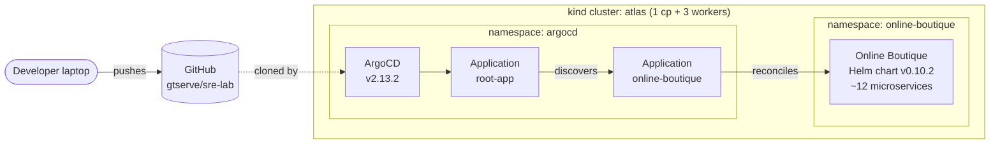

# Architecture

This document tracks the architecture of the SRE Lab across phases.
The README has the one-pane summary; this file goes deeper as the
project grows.

## Phase 0 — bootstrap

### Layers

- **Cluster layer.** A single multi-node kind cluster named `atlas`
  (1 control-plane + 3 workers) simulates a small production
  environment. Three workers enable scheduling diversity, realistic
  PodDisruptionBudget testing, and node-level chaos experiments later.
- **Platform layer.** Currently ArgoCD only, installed declaratively
  via `platform/argocd/kustomization.yaml` referencing the pinned
  upstream `install.yaml`. Future platform components
  (Prometheus, Loki, Tempo, Kyverno, Jenkins, etc.) will be
  ArgoCD-managed.
- **Application layer.** Online Boutique, vendored as the upstream
  Helm chart at `workloads/online-boutique/` with our overrides in
  `values-lab.yaml`.
- **Automation layer.** Not yet present — added in Phase 4 with
  Jenkins as the SRE automation hub.

### GitOps loop

`root-app` watches `apps/` in this repo. Adding a YAML file there is
the only step required to bring a new workload under GitOps. The root
Application's sync policy is `automated + selfHeal + prune`, so Git
is canonical for the cluster state.

## Later phases

Architecture for Phases 1+ is added here as those phases land.
